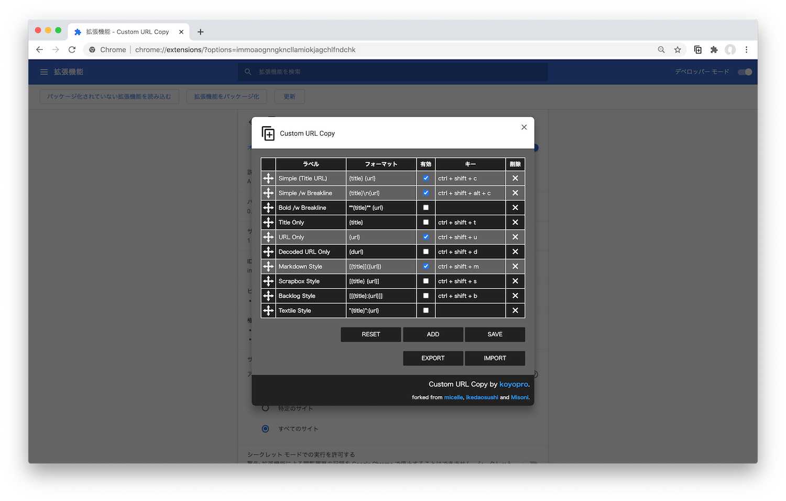

Custom URL Copy
=====

URLをコピーするのに使えるChromeの拡張です。

## インストール
[Custom URL Copy - Chrome ウェブストア](https://chrome.google.com/webstore/detail/simple-url-copy/kmkdfdfknlkjbmgdenhpeckpdafojnfo)

## 特徴
- カスタマイズ性
  - 自由にフォーマットを登録することができます
  - **各フォーマットに対してショートカットキーを設定できます**
  - デフォルトでMarkdownやScrapbox、Backlogなどのフォーマットに対応しています
  - 登録されたフォーマットは自由に並び替えができます
  - 不要なフォーマットは削除、もしくは非表示にすることができます
- 設定の同期
  - カスタマイズした設定をjsonの形式でexport/importすることができます
  - 同じユーザーでChromeにログインしていると、設定を自動的に同期することができます

## 初期登録フォーマット
| ラベル                                    | スタイル             | 備考         |
| ----------------------------------------- | -------------------- | ------------ |
| Simple (Title URL)                        | `{title} {url}`      |              |
| Simple /w Breakline                       | `{title}\n{url}`     |              |
| Bold /w Breakline                         | `**{title}**\n{url}` | 初期は非表示 |
| URL Only                                  | `{url}`              |              |
| Title Only                                | `{title}`            | 初期は非表示 |
| Markdown Style                            | `[{title}]({url})`   |              |
| [Backlog](https://www.backlog.com/) Style | `[[{title}:{url}]]`  |              |
| [Textile](https://redmine.jp/) Style      | `"{title}":{url}`    | 初期は非表示 |
| [Org mode](https://orgmode.org/) Style    | `[[{url}][{title}]]` | 初期は非表示 |

### フォーマットの追加方法
- 「Custom URL Copy」のウィンドウ内にある「Option」、もしくはアイコン右クリックから表示される「オプション」をクリックすることでOptionを開けます  
  
- 「RESET」ボタン  
  フォーマットの設定を初期化します。初期化後、設定が保存されますのでご注意ください。
- 「ADD」ボタン  
  フォーマットの枠を1つ追加できます。
- 「SAVE」ボタン  
  フォーマットの設定を保存できます。何かしらの変更があった場合、青色のボタンになります。
- その他  
  フォーマットの並び替えは左側の十字をドラッグ＆ドロップで行えます。  
  enabledにチェックが入っていると有効、使用可能になります。  
  不要なフォーマットは右側の×印から行えます。

### フォーマットで利用可能な変数
- `{title}`: ページタイトル
- `{url}`: URL(通常)
- `{durl}`: デコード後URL(URLに含まれる日本語も読める状態でコピー)

### ショートカットキーに利用可能なキーワード
- `shift`, `option`, `alt`, `ctrl`, `control`, `command`
- それ以外は内部で利用している[hotkeys](https://github.com/jaywcjlove/hotkeys#supported-keys)のドキュメントを参照ください

## forked from
- [micelle/simple-url-copy](https://github.com/micelle/simple-url-copy)
- [ikedaosushi/simple-url-copy](https://github.com/ikedaosushi/simple-url-copy)
- [MISONLN41/simple-url-copy](https://github.com/MISONLN41/simple-url-copy)
