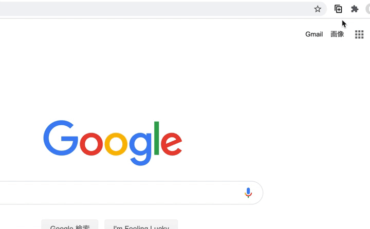
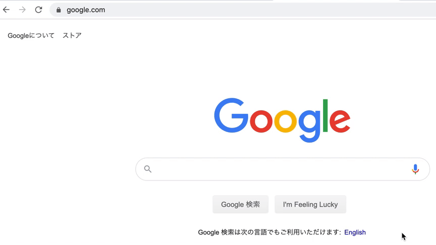

Custom URL Copy
=====

URLを手軽にコピーするためのChrome拡張です

## Demo

**Popup**

**Shortcuts**

## インストール
Chrome ウェブストア申請中

## 特徴
- カスタマイズ性
  - 自由にフォーマットを登録することができます
  - **各フォーマットに対してショートカットキーを設定できます**
  - デフォルトでMarkdownやScrapbox、Backlogなどのフォーマットに対応しています
  - 登録されたフォーマットは自由に並び替えができます
  - 不要なフォーマットは削除、もしくは非表示にすることができます
- 設定の同期
  - カスタマイズした設定をjsonの形式でexport/importすることができます
  - 同じユーザーでChromeにログインしていると、設定を自動的に同期することができます

### フォーマットで利用可能な変数
- `{title}`: ページタイトル
- `{url}`: URL(通常)
- `{durl}`: デコード後URL(URLに含まれる日本語も読める状態でコピー)

### ショートカットキーに利用可能なキーワード
- `shift`, `option`, `alt`, `ctrl`, `control`, `command`
- それ以外は内部で利用している[hotkeys](https://github.com/jaywcjlove/hotkeys#supported-keys)のドキュメントを参照ください

## forked from
- [micelle/simple-url-copy](https://github.com/micelle/simple-url-copy)
- [ikedaosushi/simple-url-copy](https://github.com/ikedaosushi/simple-url-copy)
- [MISONLN41/simple-url-copy](https://github.com/MISONLN41/simple-url-copy)
